<div align="center">
  <h1 align="center">Cynrith</h1>
  <p align="center">A presence-first fantasy RPG about layered worlds, fragile memory, and the quiet things worth carrying forward.</p>
  <p align="center">
    
    
    
  </p>
  <p align="center">Play Cynrith: https://vcore420.github.io/Cynrith/</p>
  <p align="center">Join the Discord: https://discord.gg/FNVmfMDNZa</p>
</div>

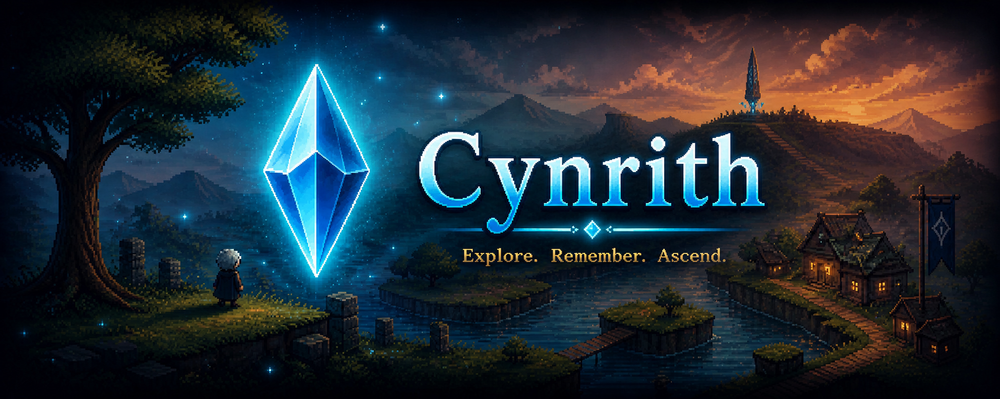

---

## Enter the World of Cynrith

Welcome to **Cynrith**, a mysterious, ever-changing world built floor by floor as a place of memory, fracture, refuge, and return. As you ascend its layered spaces, you’ll uncover small self-contained stories, meet strange characters and recurring echoes, and slowly piece together a deeper truth that bleeds through the world rather than overwhelming it.

Cynrith is designed as an ever-expanding world where each Floor has its own identity, mood, and reason to revisit. The larger story matters, but the game is built around presence first and progression second: places that feel lived in, NPCs who carry emotional weight, and rewards that help the world feel more personal over time.

---

## Core Features

- **Ascend the world:**  
  Explore a mysterious, multi-layered world filled with secrets, dangers, and branching lore.
- **Dynamic Combat System:**  
  Face a variety of enemies and bosses using real-time movement, attacks, and tactical positioning.
- **Quest-Driven Exploration:**  
  Meet unique characters, unravel floor-specific stories, and complete quests tied to place, memory, and progression.
- **Rich Worldbuilding:**  
  Every floor reveals new lore, environmental storytelling, and a different angle on Cynrith's deeper story.
- **Home Plot and Revisit Systems:**  
  Unlock the Home Plot, collect placeable rewards, build out your own space, and return to discovered Floors through Home travel.
- **Items, Weapons, and Utility Rewards:**  
  Find consumables, weapons, quest items, gems, and special-use items that can change systems rather than just stats.
- **Trader and Economy Loops:**  
  Discover traders with floor-specific stock, including skill gems, consumables, and Home Plot items.
- **Skill Progression:**  
  Build your character through a gacha-based skill system with rarity, upgrades, buffs, drawbacks, and advanced effects.
- **Multi-Platform Play:**  
  Designed for both desktop and mobile, with intuitive controls and a seamless interface.
- **Ever-Expanding Story:**  
  Cynrith is intended as a forever-expanding project, with new Floors, side spaces, worldbuilding, and systems added over time.
- **Atmospheric Visuals:**  
  Hand-crafted maps, evocative environments, and unique character designs bring the world to life.

## Current State

- Floors 1 to 6 are in the game.
- Floors 1 to 6 have gone through a major dialogue and narrative pass to better fit the current tone of the project.
- The Home Plot is introduced at the end of Floor 2 and is now part of the game's long-term reward and revisit loop.
- Floors 2, 3, and 4 now feed Home Plot rewards, with traders also supporting that loop.
- Floor 5 and Floor 6 dialogue now match the newer narrative direction used across the earlier Floors.
- The project's story canon and engine docs have been expanded so future floor work stays consistent.

## Getting Started

1. **Clone the repository:**
   ```bash
   git clone https://github.com/vCore420/Cynrith.git
   cd Cynrith
   ```
2. **Open `index.html` in your browser**  
   (requires live server, vscode has an extension)

## Screenshots

<p align="center">
  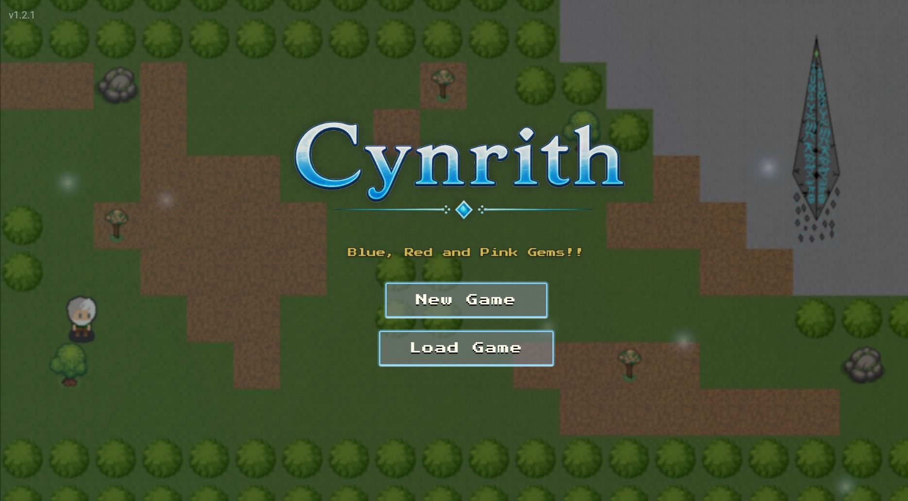
  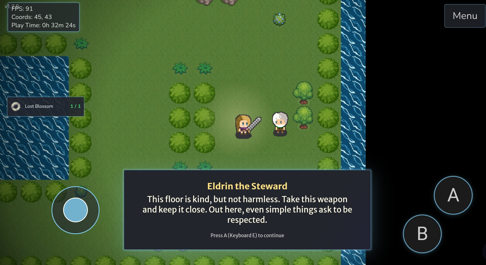
  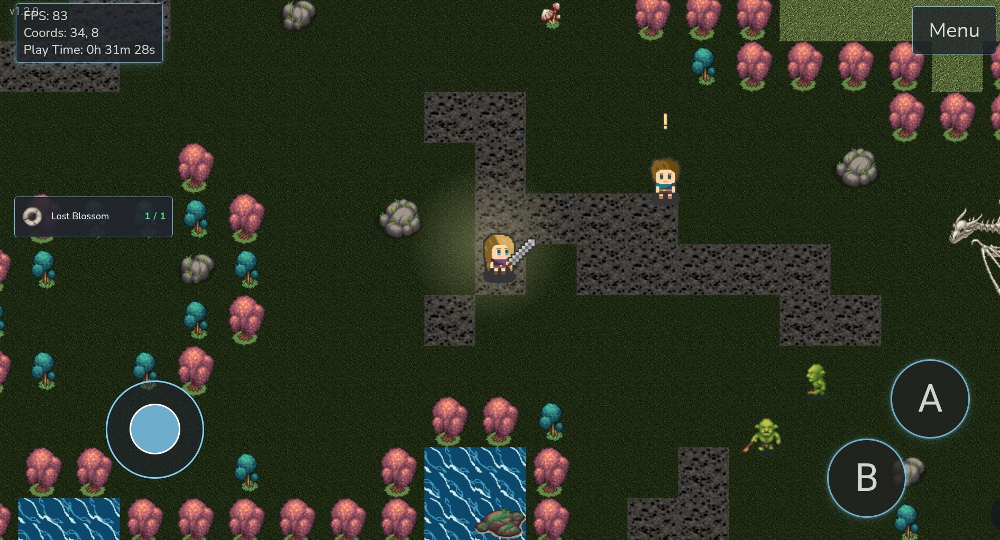
  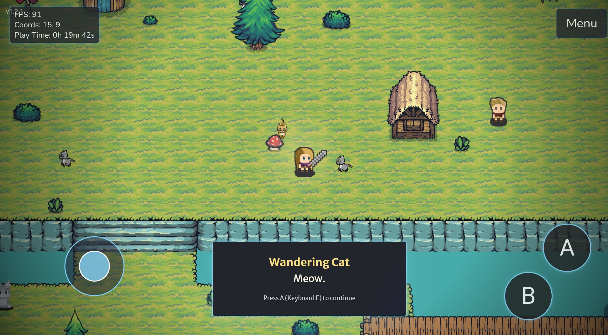
  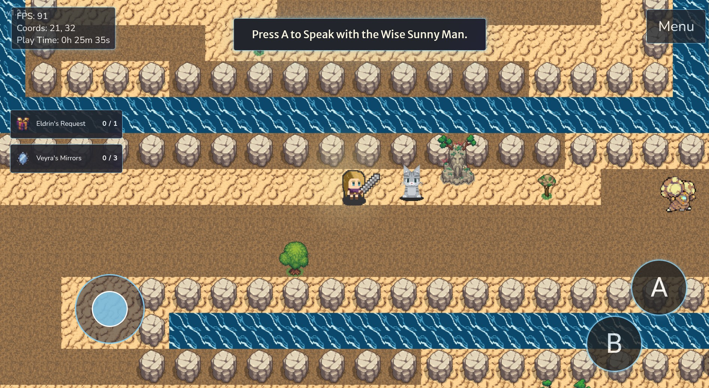
  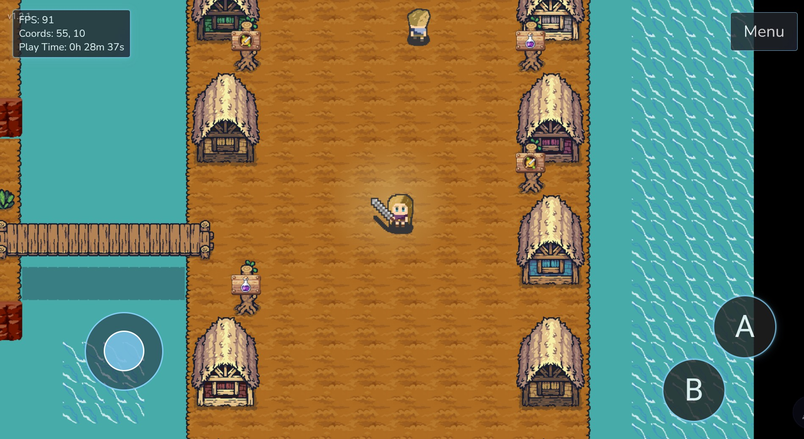
  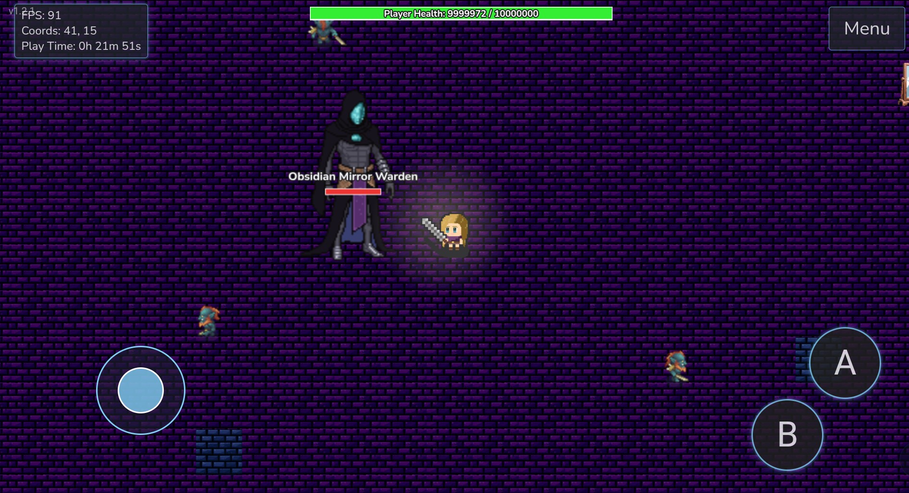
</p>

<details>
<summary>Roadmap</summary>

<p>

**Completed**

- Floors 1-6 implemented in-game
- Major narrative and dialogue pass across Floors 1-6
- Dynamic map loading 
- Real-time combat, death and respawn system
- Modular sprite sheet loader
- Animated, interactable teleport stones and map warping
- Interactable tiles with rewards for hidden secrets 
- Usable Items 
- Weapons and utility item support
- Player Stats, player buffs and dynamic stat adjustments
- NPCs and enemies with pathfinding, interactions and triggers
- Improved forced encounter pathing and prompt handling
- Quest system with branching lore and dynamic UI
- Multi types of quest can be given to the player (item collection, enemy defeats, stat gain)
- Player menu UI with inventory, quests, stats, skills, map and settings
- Clean Inventory system
- Player Skill System
- Save/load system for persistent progress
- Multi-platform controls (desktop & mobile)
- Lore intro and evolving story
- Multi-layered world and floor progression
- Notifications and dialogue system
- Forced encounters and event triggers
- Trader Npc with buy/sell menus
- World, Dialogue, Player and Combat sounds effects and music
- Home Plot system with travel, storage, placement, and interior support
- Home Plot item rewards and trader support
- Expanded documentation for floor creation, engine systems, and story canon
- Installable for mobile devices
- Interact tiles for interiors/caves
- Boss battles
- Ui Sound effects

**To DO**

- Improved assets and polish
- Continue expanding new Floors, side spaces, and revisit loops
- Continue refining Home Plot content and world feel
- Ongoing QOL and presentation improvements

- Planning to make this a forever expanding project, something i just wanted to have as my own little world! I have tried to make it as modular as i know how to so I can keep expanding the game and world as time goes on!
</p> 
</details>

---

## Documentation

- Story canon: [Cynrith_Story_Core.md](Cynrith_Story_Core.md)
- Floor workflow: [Floor_Creation_Guide.md](Floor_Creation_Guide.md)
- Home Plot system: [docs/homePlot.md](docs/homePlot.md)
- Engine reference: [docs/function_libary.md](docs/function_libary.md)
- Content planning: [docs/content_tracker.md](docs/content_tracker.md)

---
<details>
<summary>Change Logs</summary>

<p>

15/5/26 v1.2.1

- Temp World Sprite system created
- Rootbound Skill Updated to use this new temp world sprite system to display Vines Sprite upon enemy deaths
- Worked on floor 7, Added first lot of enemys to floor

---

10/5/26 v1.2.0

- Player Sprites polished 
- Npc Sprites polished and more were created
- Player menu css adjusted
- Title screen logo created
- Docs Expanded / Updated

---

3/5/26 v1.1.9

- Updated app icon and banner image
- Expanded Skill system to allow for unique fuctions to be created for each skill
- New Skills added
- More Home Plot Items Created
- More work on floor 7 done

---

26/4/26 v1.1.8b

- Added a new family of Home Plot items themed for Floors 5 and 6
- Created interactable tiles on Floors 5 and 6 awarding each new Home Plot item, with custom dialogue and map placements.
- Fixed Home Plot teleport stone progression: floors now unlock on first entry by calling markFloorVisited at the correct trigger points.
- Improved trader menu UI: added scroll and max-height to prevent the menu from growing off-screen with long item lists.
- This brings us back to where we were with building Floor 7, this is the last update for v1.1.8 involving the re-wrok of each floors feel from floors 1-6 and the addition of the home plot system being intergrated with the game and story so far.

---

20/4/26 v1.1.8a

- Floors 5 and 6 dialogue updated to match the newer narrative direction used across the rest of the game.
- Added a dedicated story core document to keep Cynrith's main narrative references consistent.
- Expanded engine and world documentation to better support future floor creation and content work.

---

19/4/26 v1.1.8

- Massive NPC dialogue pass across Floors 1 to 5, shifting the tone toward presence first and progression second.
- Home Plot introduction now happens at the end of Floor 2.
- Added Home Plot loot rewards across Floors 2, 3, and 4.
- Traders on Floors 3 and 4 now support the Home Plot loop with placeable item stock.
- Improved forced encounter NPC pathing so they no longer get stuck on collision as easily.
- Removed normal NPC interaction notifications during forced encounters.

---

12/4/26 v1.1.7

- Added Floor 7 setup content and progression hooks (new NPC/trader data and supporting map content)
- Added Home Plot access flow:
  - New gift quest reward: **Key without a Door**
  - Using the key now warps player to `home_plot0`
- Added Home Plot travel system:
  - Spawn stone on Home Plot opens floor-select menu
  - Player can only travel to floors already visited
- Added visited floor tracking and save/load persistence for travel unlocks
- Added first Home Plot customization framework:
  - New `homePlot.js` module for Home Plot systems
  - Place/Edit modes for placing and removing items
  - Mouse and touch placement preview/confirm behavior
  - Placement save/load persistence
- Added Home Plot HUD button:
  - Appears only while on Home Plot
  - Opens/closes Home customization menu
  - Hidden automatically when leaving Home Plot
- Added Home placeable item definition support in items:
  - `homePlaceable` + `homeDef` metadata
  - First item added: `home_chair_oak`
- Home placeables now route to Home storage (not normal inventory slots)
- Improved placement rules:
  - Prevent placement on player tile
  - Prevent placement on collision/blocked tiles and teleport stone tiles

---

11/3/26 v1.1.1

- **Floor 6: Waystation Veil & Castle Interior** - New floor with castle interior tiles, new story elements, and familiar faces from previous floors
- **Settings Persistence** - Fixed player settings (touch controls, log display, volume sliders) not saving/loading properly
- **DOM Access Errors** - Resolved "can't access property 'style'" errors during game load by adding null checks
- **Touch Controls** - Fixed touch controls not restoring visibility properly on game load (joystick was still showing when disabled)
- **Sound Manager** - Corrected method name from setSfxVolume to setEffectVolume for volume slider functionality
- **Sprite Collision** - Improved collision detection for world sprites to prevent head clipping using z-index logic
- **Mini Map Rendering** - Updated mini map to display all layers except the top decorative layer for better navigation
- **Version Watermark** - Added version watermark to title screen for better version tracking
- **Settings Management** - Refactored gameSettings to use window.gameSettings for proper scope and persistence
- **Save/Load System** - Enhanced save data structure to include settings and improved restoration logic
- **Service Worker** - Updated cache version to v1.1.1 for proper offline functionality

---

3/2/26 v1.0.0

- Intractable tile mechanics updated, they can now teleport player to different coords on interaction, this works across maps too opening up intractable tiles to more uses. also added the ability to allowing intractable tiles to be re triggered. This will all be first seen in use on floor 5
- Core Map warping function updated to accept any name or map number, allowing for future dungeon maps to be added - this should work like this for all map referencing across the definitions
- Floor 5 has been worked on, first Npc quest is under way, npc and quest is made, teleport and loot mirrors are still needing to be set up around the map to marry this quest together - add a couple of story heavy mirors
- Game is now taking a turn as the original FF7 has opened my eyes to the amazing world of these rpg style games, this is where the story gets deep

- First quest fully set up for floor 5, mirrors all set up for quest, could do with a few more loot and dialouge ones around the map
- npcs added to foyer of floor 5
- first enemys added to floor 5 - Umbral Slimes
- Trader added to floor 5 with new game items and skill gems for sale
- Upgraded npc/enemy loader to allow for custom sprite size for bosses
- Floor 5 Boss added, npc to warn about boss added, new enemys added across floor 5

- Added new trigger tiles around flor 5 for lore
- added new quest giver to floor 5 maze
- Added new quest npc, lore npc, mini boss, covered the floor in mirrors (loot/lore/teleport) sunny man added and up to no good\
- World sprites added to floor 5, new enemy sounds added bringing floor 5 to completion

---

7/9/25 Beta v0.2.2

- Skill system Created: Gatcha system for obtain skills, rarity-based upgrade costs, advanced skill logic (regen, xpGain, resistance)
- Added skills, with templates for easy future additions.
- Skill menu UI: dropdown details, equip/unequip logic, and stat display updates.
- Player stats now update live in the menu when skills are equipped, unequipped, or upgraded.
- Health regeneration logic now supports both healing and draining, with death triggers and health bar display.
- Touch controls reworked: replaced D-Pad with a draggable joystick for smoother mobile movement.
- Joystick now respects controlsEnabled flag and is styled for both desktop and mobile.
- Settings menu updated to toggle new joystick controls.
- Player-NPC collision logic improved: switched to pixel-based collision with padding for more natural movement and less "stuck" behavior.
- Roadmap and documentation updated to reflect new systems and guides.

---

6/9/25 Beta v0.2.1

- Player movement fully reworked for WASD keys, with fluent diagonal movement and last-key priority.
- Action buttons mapped: Enter for interaction, Space for combat, Esc to open/close player menu.
- Settings menu added: toggle touch controls, show/hide log, adjust music and SFX volume with themed sliders and switches.
- Settings are saved and restored with your game.
- Cynrith is now installable as a PWA, add to your device and play offline.
- NPCs with ready-to-complete quests now show a golden ‘!’ above their heads.
- Player now spawns below teleport stones to avoid collision issues.
- UI and settings menu styled for desktop and mobile.
- Minor fixes for quest/NPC logic and asset loading when warping between maps.

---

4/9/25 Beta v0.2.0

- Floor 4 
  - New floor map and tile assets
  - New enemy assets and definitions
  - New Items/loot for F4
  - New Npc's and Traders
  - New Quests and story hooks
  - Created finer details about F4 in World Building

- Performance Improvements 
  - Created new Welcome screen to pre load the game assets 
  - Preload and cache all sfx sounds
  - Preload title map 
  - Forces user page interaction before loading sounds
  - Throttled combat sfx
  - Combat SFX logic improved to avoid overlap
  - Improved ambient enemy sound logic 
  - Fixed Lag with enemy deaths

- Ui Improvements 
  - Inventory menu now has expandable pages
  - Useable items can now use used in bulk just like removing items
  - Improved Notifications for inventory usage
  - Added sfx for inventory menu

- Small Changes
  - Increased cooldown for enemy respawn
  - Increased the time the intro story plays, for better readability

- Documentation
  - Roadmap and world building docs are up-to-date
  - Contributor guide and templates for definitions Created

---

28/8/25 Beta v0.1.3

- Added enemy ambient sounds that increase with player distance to them
- Added sound types to trigger and interactable tiles with loop, ambient and trigger options
- Updated definitions templates
- Updated cat spritesheet asset
- Created better documention for how to create new floors and all other assets

---

27/8/25 Beta v0.1.2

- Expanded sound system: contextual background music for each map and title screen, with smooth fade transitions.
- Player movement now triggers ground tile-specific footstep sounds, supporting multi-layer maps and all defined tile types.
- Added combat sounds: sword slash and sword hit effects play when attacking and hitting enemies.
- Player receives a hit sound when damaged by enemies.
- Player death now triggers a dedicated death sound effect.
- Dialogue system now fades background music and plays a sound on each dialogue advance.
- Item pickup sounds play based on item rarity; usable items play their defined sound effect.
- Improved sound timing for footsteps to better match player movement animation.
- Fixed ground tile sound logic to support all asset types and multi-layer maps.
- Ensured background music only starts after user interaction

---
  
26/8/25 Beta v0.1.1

- Added background music for title screen and each map, with smooth transitions.
- Introduced modular sound system for music and effects.
- Player footsteps now play and change based on ground tile type.
- Sound assets integrated for world and player actions.

---
  
23/8/25 Beta v0.1.0

- Added new quest types and improved quest logic (stat tracking, interactTiles, redoable quests)
- Expanded interactable and trigger tile system (animated tiles, notifications, persistent state)
- Created reusable content tracker for NPCs, items, and lore objects
- Added templates for NPCs, enemies, items, traders, interactable/trigger tiles, and quests
- Implemented modular trader/shop system
- Improved quest HUD, inventory, and trader UI
- Expanded documentation for easier contribution and onboarding
- Finished Creation Floor 3!
- First Beta Release "Cynrith Beta v0.1.0" pushed!!
</p> 
</details>

---

## Contributing & Documentation

Pull requests and suggestions are welcome!

**Cynrith Toolkit:**  
To contribute new game content (NPCs, quests, items, skills, tiles, sprites, and more), use the [vCynrithToolkit](https://vcore420.github.io/vCynrithToolkit/) — a browser-based editor designed specifically for Cynrith.  
The toolkit streamlines creation, editing, and export of all game definitions and assets, making it easy for contributors to build and preview content before submitting.


Check out the Documentation below for information needed to contribute:

- [vCynrithToolkit](https://vcore420.github.io/vCynrithToolkit/) – **Recommended for all content creation and editing**
- [Cynrith Story Core](Cynrith_Story_Core.md)
  _Primary canon reference for Cynrith's core story and floor-story direction._
- [Roadmap](docs/roadmap.md)  
  _My Current goals, plans, and development roadmap for Cynrith._
- [Function Library](docs/function_libary.md)  
  _Every created function in the project so far, with explanations and usage._
- [World Building](docs/world_Building.md)  
  _Current and upcoming Lore, story, and the evolving world of Cynrith._
- [Content Tracker](docs/content_tracker.md)  
  _All content (item, characters, lore refs, etc) currently created in the world of Cynrith._
- [Floor Creation Guide](Floor_Creation_Guide.md)  
  _Guidelines and best practices for creating new floors and/or other aspects of floors in Cynrith._

## Credits
 
This project is a fork and extension of [orangeable/javascript-2d-tile-based-game](https://github.com/orangeable/javascript-2d-tile-based-game), with a complete rework to become the game 'Cynrith', orangebles simple concept for the tile base game was the perfect inspiration to create the full blown project it has become.

**Cynrith Toolkit:**  
Created and maintained by vCore420, the [vCynrithToolkit](https://vcore420.github.io/vCynrithToolkit/) is the official editor for all Cynrith game content.  
It enables fast, visual creation and editing of NPCs, enemies, quests, items, skills, tiles, sprites, and more, and is recommended for all contributors.

Other assets have been made, edited or sourced from the following:

- https://www.pixellab.ai - Used for Editing and Creating Spritesheets and Tile assets utilising their Ai features
- https://www.piskelapp.com - Used to Edit and Create Spritesheets and Tile Assets
- https://itch.io/game-assets - Used for sourcing base Spritesheets, tiles and Sfx 


**⚠️ This project is in early development. All game assets are test/beta and subject to change.**

## Contributors 

[](https://github.com/vCore420/Cynrith/graphs/contributors)

[](https://github.com/vCore420/Cynrith/graphs/contributors)

- Designed, extended, customized, and maintained by vCore420
- **Toolkit:** [vCynrithToolkit](https://vcore420.github.io/vCynrithToolkit/) – for all game content creation and contribution

---

<details>
<summary>🎨 Concept Art Gallery</summary>

<p align="center">
  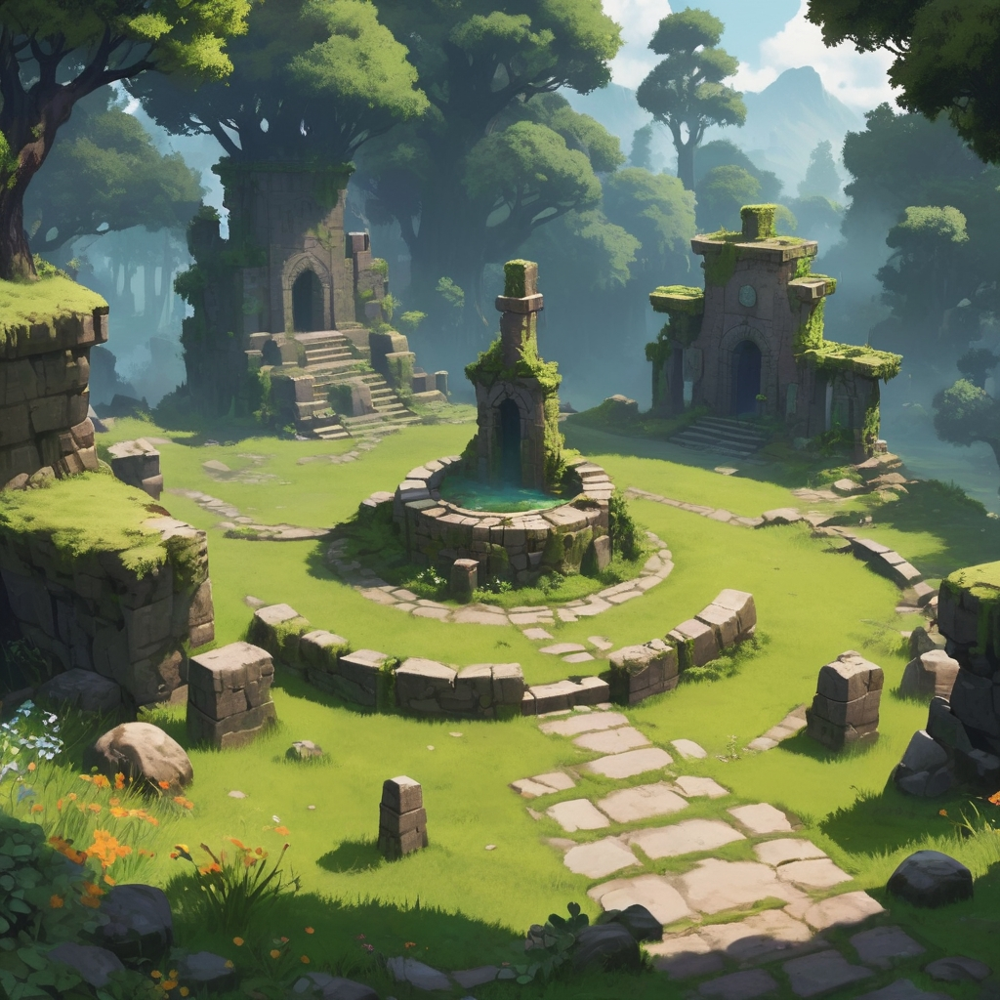
  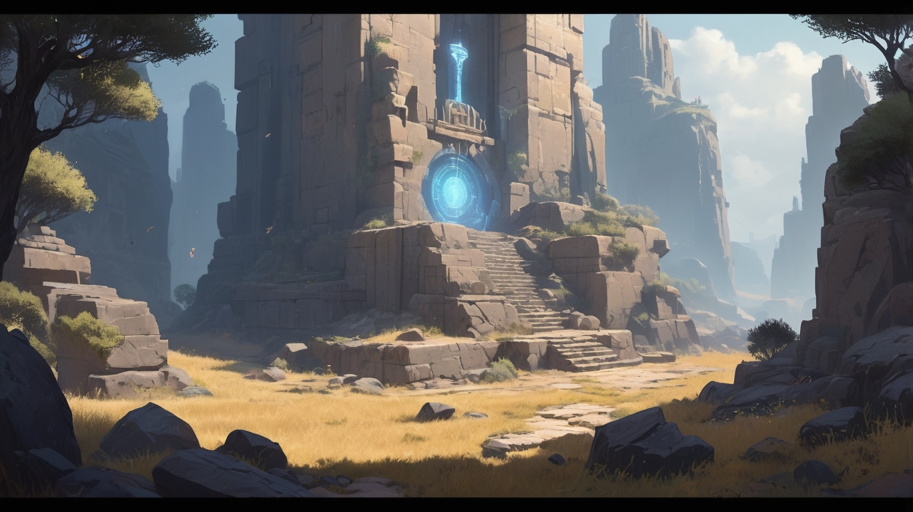
  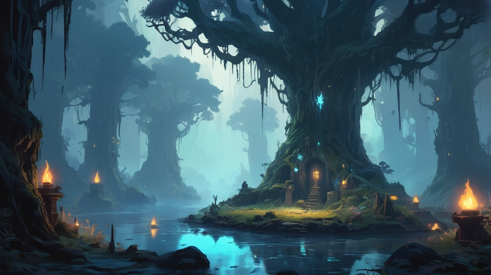
  
  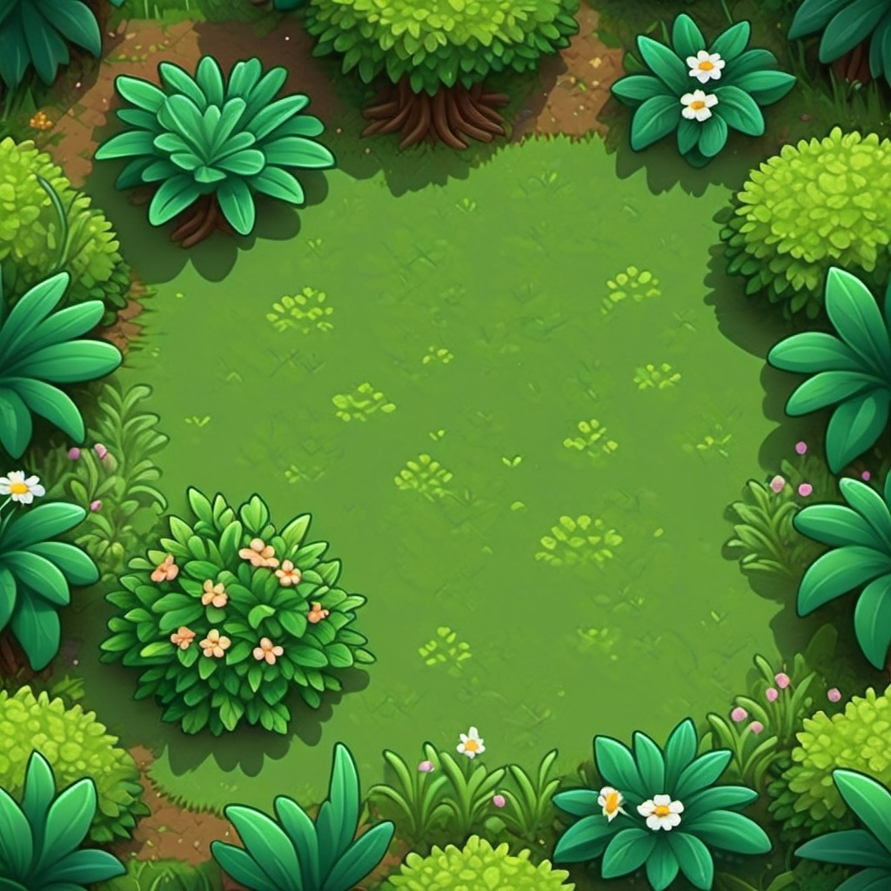
  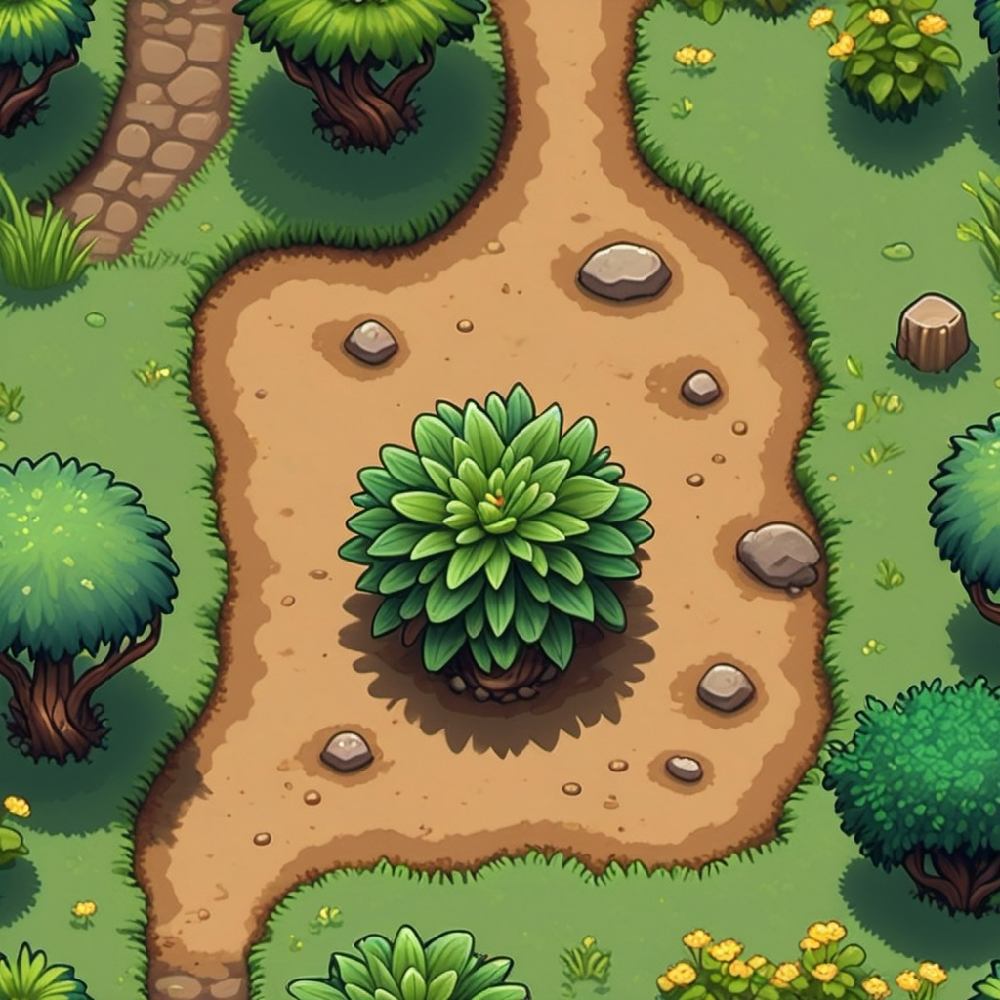
  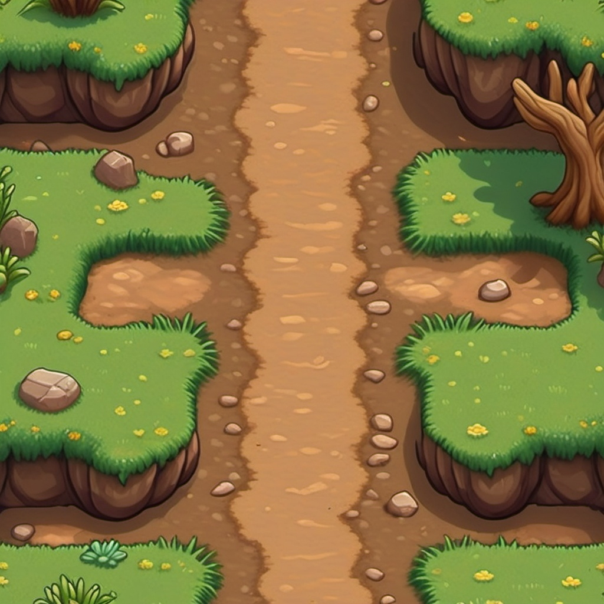
  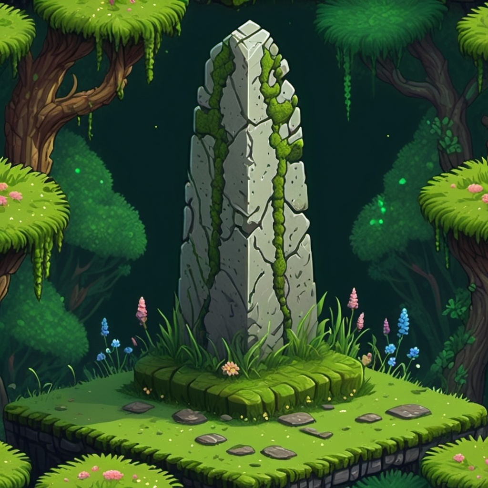
  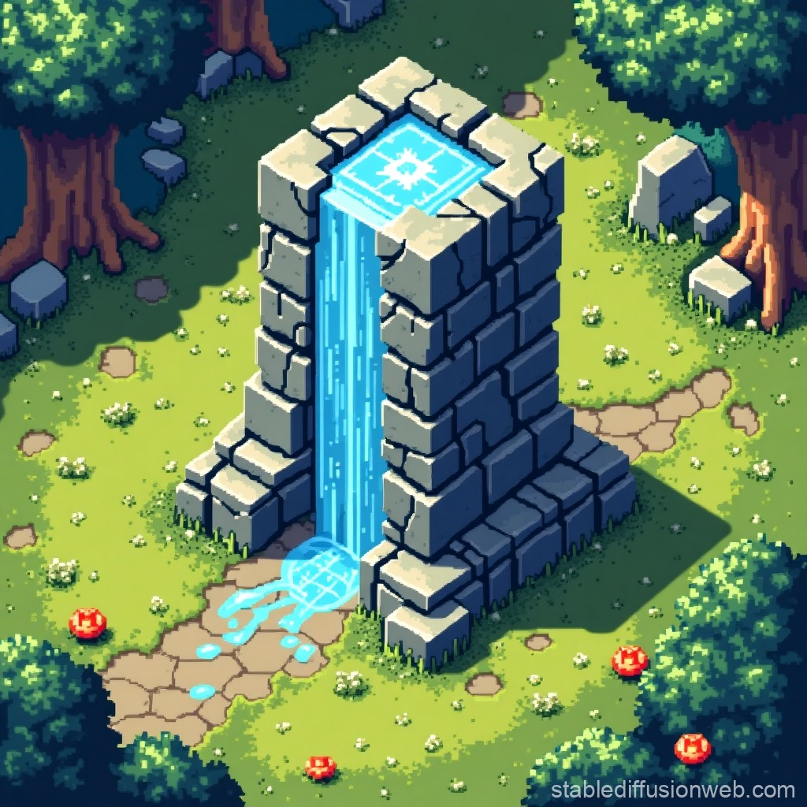
  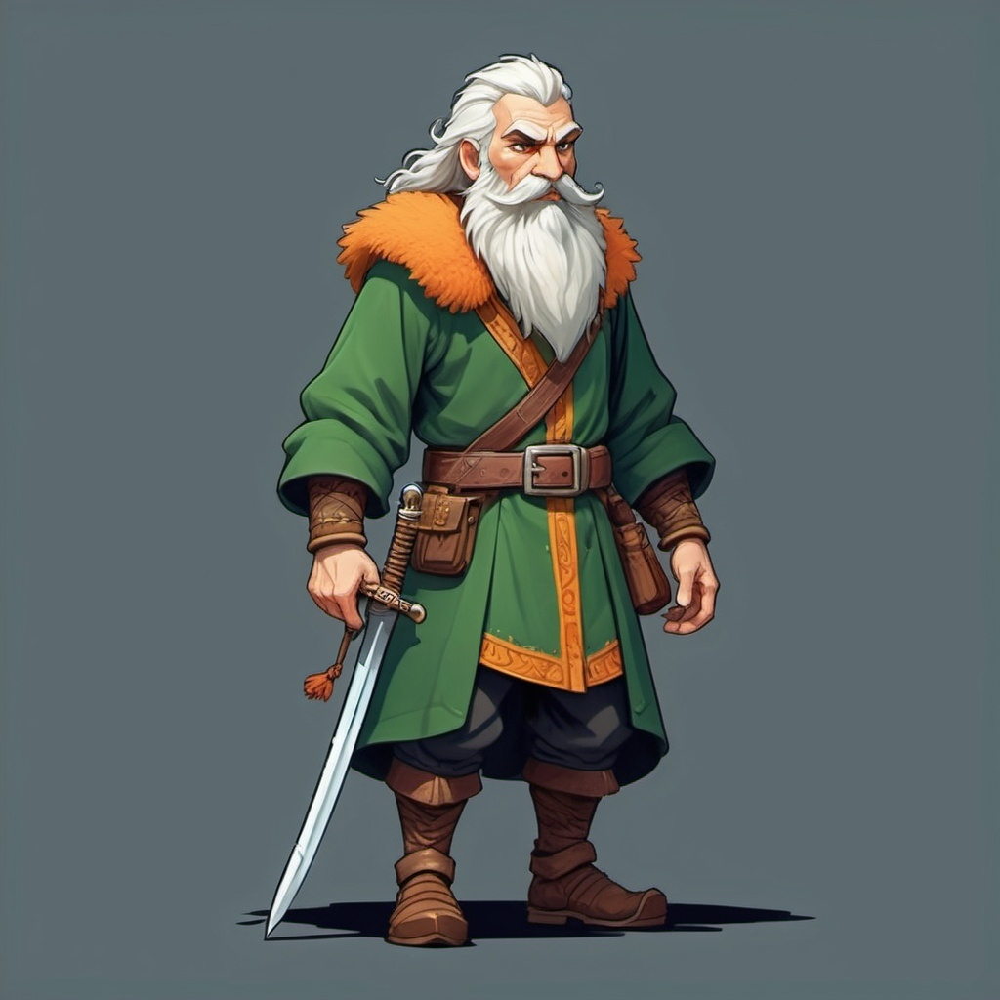
</p>

</details>

---

## License

This project is licensed under the MIT License.

