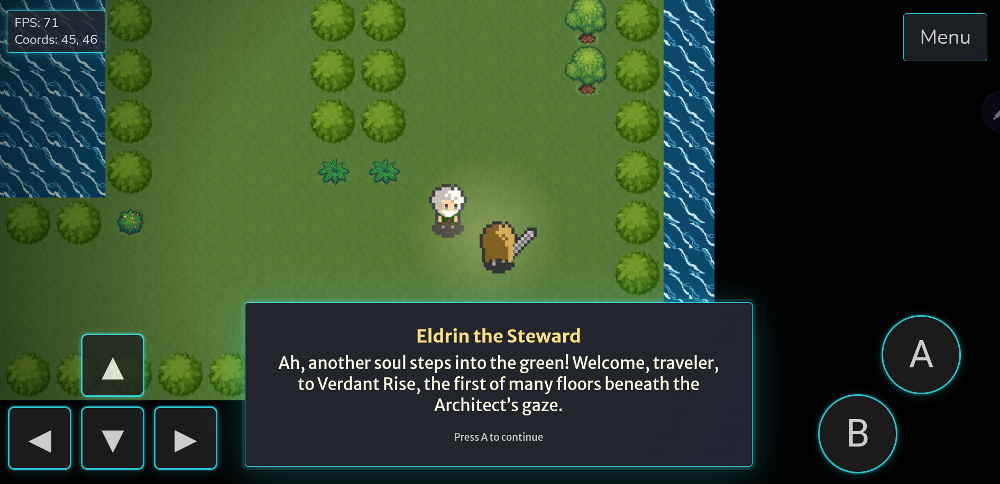
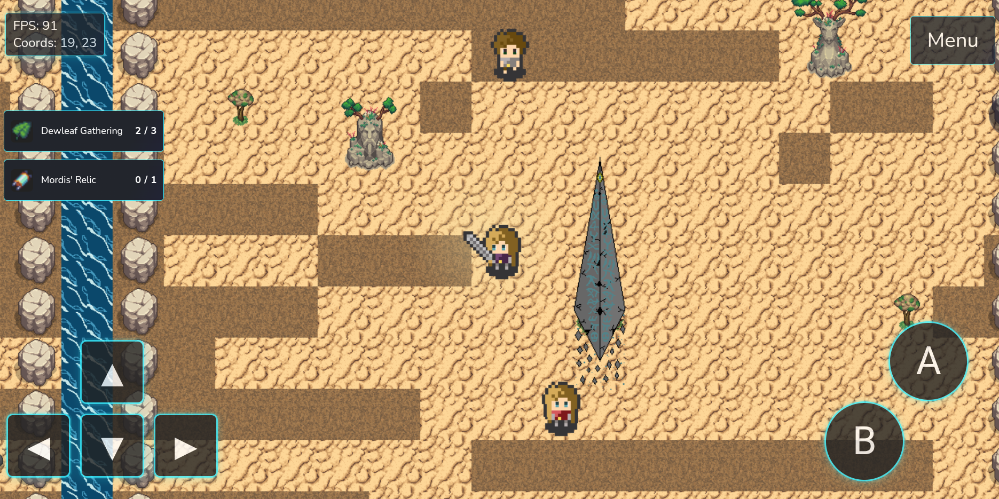
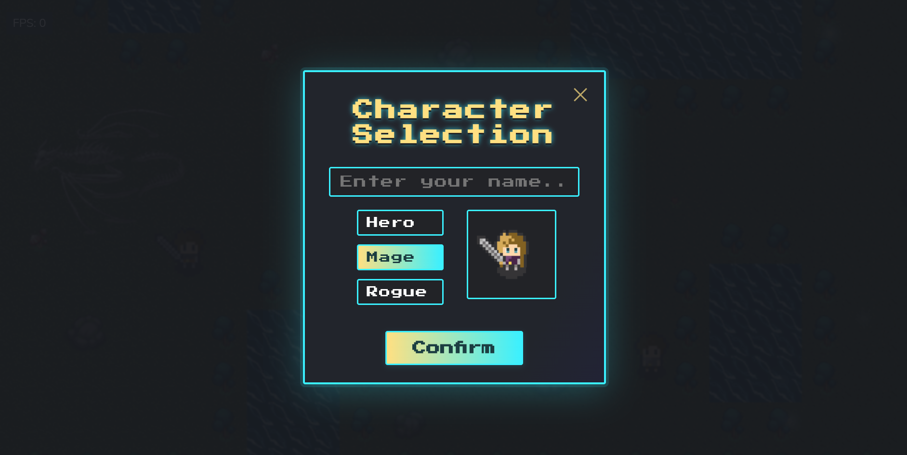
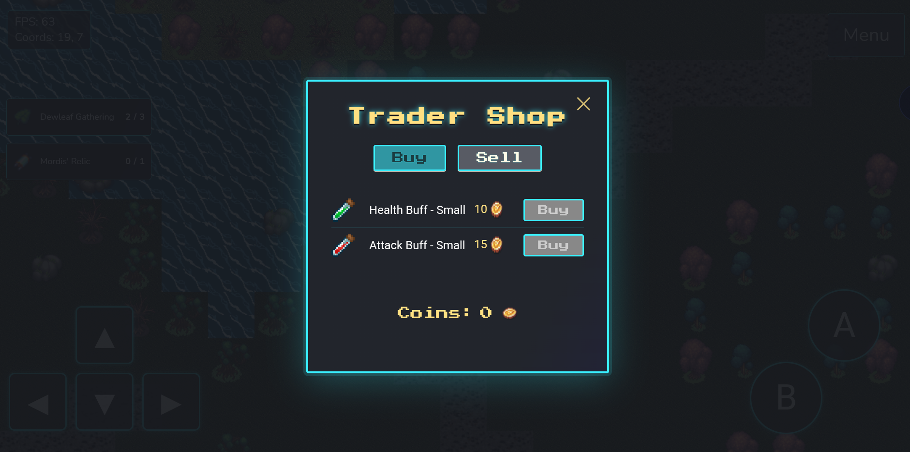
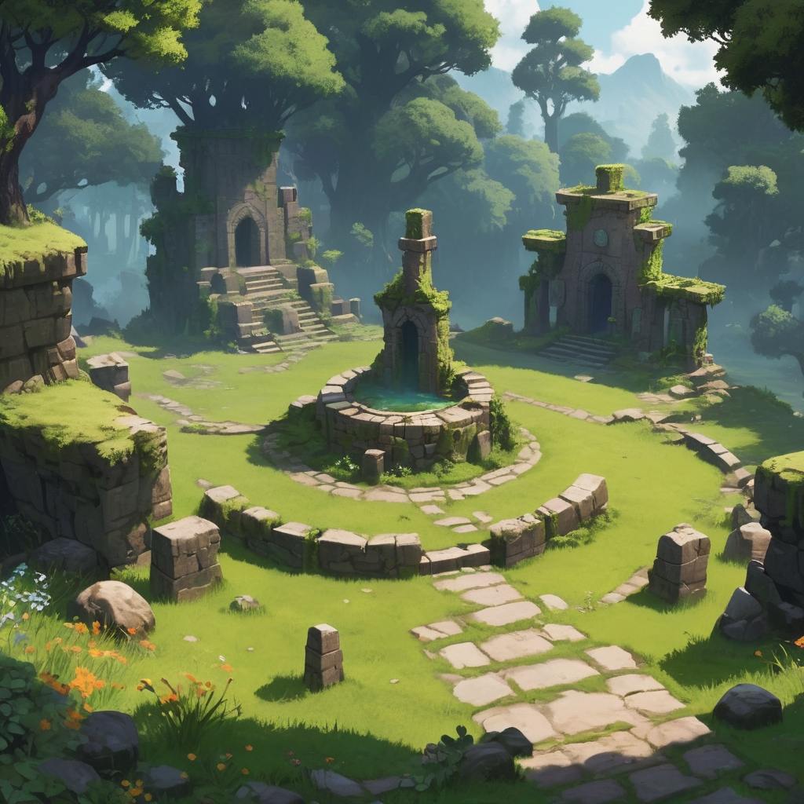

<div align="center">
  <h1 align="center">Cynrith</h1>
  <p align="center">A mysterious, ever-changing world woven from the dreams and ruins of lost civilizations.</p>
  <p align="center">
    
    
    
  </p>
</div>


---

## Enter the World of Cynrith

Welcome to **Cynrith**, a mysterious, ever-changing world woven from the dreams and ruins of lost civilizations. As you ascend its labyrinthine Floors, you’ll uncover ancient secrets, encounter strange characters and foes, and find your choices echoing through the very fabric of the System. Each Floor offers new lore, challenges, and opportunities to shape your story within a living, ever-expanding game.

Long before the first Floor rose, Cynrith was a single, boundless realm; flourishing with life, magic, and hope. The Architect, neither god nor machine, but something between, watched over this world and gently nudged its people toward greatness. But ambition bred conflict, and in time, the world threatened to spiral into chaos. To save Cynrith from itself, the Architect shattered the world into vertical layers 'Floors' each a memory, a lesson, or a prison. Now, you stand among the few chosen to ascend, discover, and perhaps one day, reunite what was broken.

---

## Core Features

- **Ascend the world:**  
  Explore a mysterious, multi-layered world filled with secrets, dangers, and branching lore.
- **Dynamic Combat System:**  
  Face a variety of enemies and bosses using real-time movement, attacks, and tactical positioning.
- **Quest-Driven Exploration:**  
  Meet unique Characters, unravel their stories, and complete quests that impact your journey and the world.
- **Rich Worldbuilding:**  
  Every floor reveals new lore, environmental storytelling, and hidden mysteries to discover.
- **Relic and Inventory System:**  
  Find, collect, and use powerful relics—each with their own story and gameplay effect.
- **Multi-Platform Play:**  
  Designed for both desktop and mobile, with intuitive controls and a seamless interface.
- **Ever-Expanding Story:**  
  Cynrith is a living world—expect frequent updates, new floors, and evolving lore.
- **Atmospheric Visuals:**  
  Hand-crafted maps, evocative environments, and unique character designs bring the world to life.

## Getting Started

1. **Clone the repository:**
   ```bash
   git clone https://github.com/vCore420/Cynrith.git
   cd Cynrith
   ```
2. **Open `index.html` in your browser**  
   (requires live server, vscode has an extension)

## Screenshots

<p align="center">
  
  
  
  
  
  
  
</p>

## Roadmap

**Completed**

- Dynamic map loading 
- Real-time combat, death and respawn system
- Modular sprite sheet loader
- Animated, interactable teleport stones and map warping
- Interactable tiles with rewards for hidden secrets 
- Usable Items 
- Player Stats, player buffs and dynamic stat adjustments
- NPCs and enemies with pathfinding, interactions and triggers
- Quest system with branching lore and dynamic UI
- Multi types of quest can be given to the player (item collection, enemy defeats, stat gain)
- Player menu UI
- Clean Inventory system
- Save/load system for persistent progress
- Multi-platform controls (desktop & mobile)
- Lore intro and evolving story
- Multi-layered world and floor progression
- Notifications and dialogue system
- Forced encounters and event triggers

**To DO**

- Skill System
- Settings menu
- Map menu
- trigger tiles for interiors/caves
- Shop/trader system
- Floor and Storyline expansion 
- Improved assets and polish
- Expand documentation

- Planning to make this a forever expanding propject, something i just wanted to have as my own litle world! I have tried to make it as modular as i know how to so I can keep expanding the game and world as time goes on!

## Documentation

- [Roadmap](docs/roadmap.md)  
  _Current goals, plans, and development roadmap for Cynrith._
- [Function Library](docs/function_libary.md)  
  _Every created function in the project, with explanations and usage._
- [World Building](docs/world_Building.md)  
  _Lore, story, and the evolving world of Cynrith._
- [Content Tracker](docs/content_tracker.md)  
  _All content (item, characters, lore refs, etc) currently created in the world of Cynrith._

## Credits

A browser-based 2D tile game built with JavaScript, HTML5, and Canvas.  
This project is a fork and extension of [orangeable/javascript-2d-tile-based-game](https://github.com/orangeable/javascript-2d-tile-based-game), with a complete rework to become the game 'Cynrith', orangebles simple concept for the tile base game was the perfect inspiration to create the full blown project it has become.

**⚠️ This project is in early development. All game assets are test/beta and subject to change. Utilising the original assest from orangebles for my beta as i create this game but will all be polished for release**

## Contributors 

[](https://github.com/vCore420/Cynrith/graphs/contributors)

[](https://github.com/vCore420/Cynrith/graphs/contributors)

- Designed, extended, customized, and maintained by vCore420

## Contributing

Pull requests and suggestions are welcome!

---

<details>
<summary>🎨 Concept Art Gallery</summary>

<p align="center">
  
  
  
  
  
  
  
  
  
  
</p>

</details>

---

## License

This project is licensed under the MIT License.

