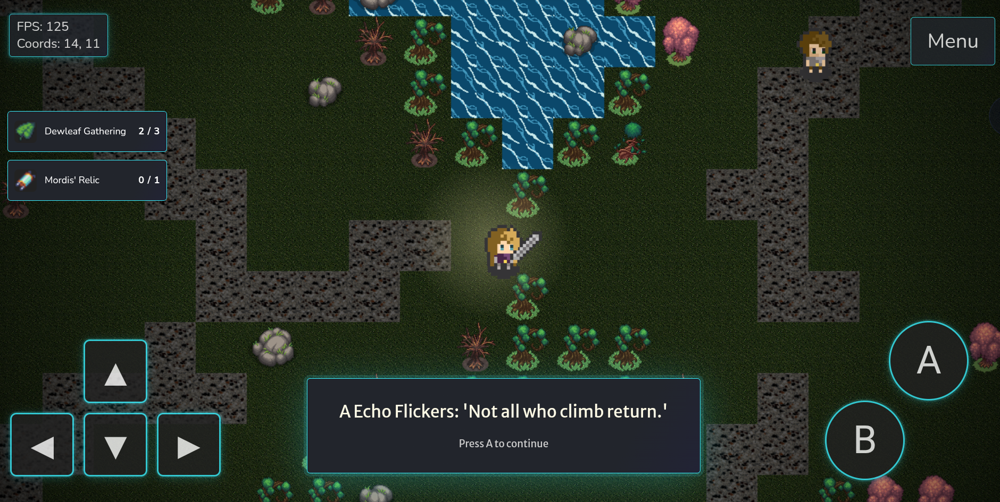
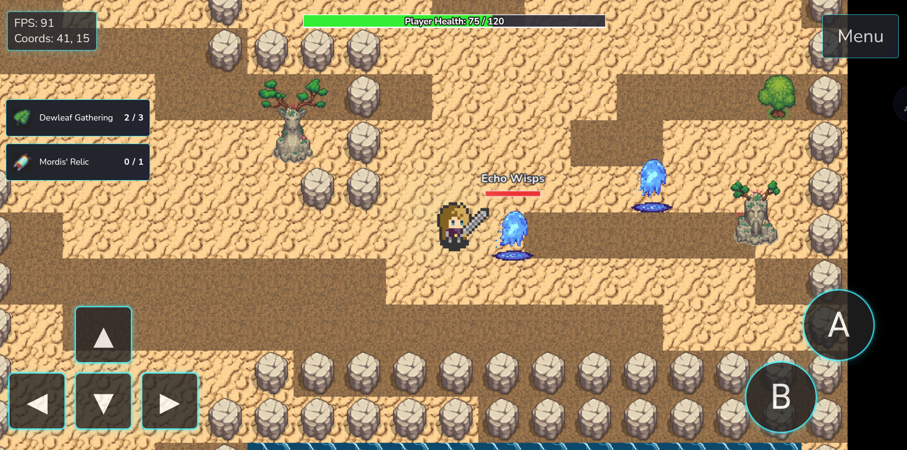

<div align="center">
  <h1 align="center">Cynrith</h1>
  <p align="center">A mysterious, ever-changing world woven from the dreams and ruins of lost civilizations.</p>
  <p align="center">
    
    
    
  </p>
</div>


---

## Enter the World of Cynrith

Welcome to **Cynrith**, a mysterious, ever-changing world woven from the dreams and ruins of lost civilizations. As you ascend its labyrinthine Floors, you’ll uncover ancient secrets, encounter strange characters and foes, and find your choices echoing through the very fabric of the System. Each Floor offers new lore, challenges, and opportunities to shape your story within a living, ever-expanding game.

Long before the first Floor rose, Cynrith was a single, boundless realm; flourishing with life, magic, and hope. The Architect, neither god nor machine, but something between, watched over this world and gently nudged its people toward greatness. But ambition bred conflict, and in time, the world threatened to spiral into chaos. To save Cynrith from itself, the Architect shattered the world into vertical layers 'Floors' each a memory, a lesson, or a prison. Now, you stand among the few chosen to ascend, discover, and perhaps one day, reunite what was broken.

---

## Core Features

- **Ascend the world:**  
  Explore a mysterious, multi-layered world filled with secrets, dangers, and branching lore.
- **Dynamic Combat System:**  
  Face a variety of enemies and bosses using real-time movement, attacks, and tactical positioning.
- **Quest-Driven Exploration:**  
  Meet unique Characters, unravel their stories, and complete quests that impact your journey and the world.
- **Rich Worldbuilding:**  
  Every floor reveals new lore, environmental storytelling, and hidden mysteries to discover.
- **Relic and Inventory System:**  
  Find, collect, and use powerful relics—each with their own story and gameplay effect.
- **Multi-Platform Play:**  
  Designed for both desktop and mobile, with intuitive controls and a seamless interface.
- **Ever-Expanding Story:**  
  Cynrith is a living world—expect frequent updates, new floors, and evolving lore.
- **Atmospheric Visuals:**  
  Hand-crafted maps, evocative environments, and unique character designs bring the world to life.

## Getting Started

1. **Clone the repository:**
   ```bash
   git clone https://github.com/vCore420/Cynrith.git
   cd Cynrith
   ```
2. **Open `index.html` in your browser**  
   (requires live server, vscode has an extension)

## Screenshots

<p align="center">
  
  
  
  
  
  
  
</p>

## Roadmap

**Completed**

- Dynamic map loading 
- Real-time combat, death and respawn system
- Modular sprite sheet loader
- Animated, interactable teleport stones and map warping
- Interactable tiles with rewards for hidden secrets 
- Usable Items 
- Player Stats, player buffs and dynamic stat adjustments
- NPCs and enemies with pathfinding, interactions and triggers
- Quest system with branching lore and dynamic UI
- Multi types of quest can be given to the player (item collection, enemy defeats, stat gain)
- Player menu UI
- Clean Inventory system
- Save/load system for persistent progress
- Multi-platform controls (desktop & mobile)
- Lore intro and evolving story
- Multi-layered world and floor progression
- Notifications and dialogue system
- Forced encounters and event triggers
- Trader Npc with buy/sell menus
- World, Dialogue, Player and Combat sounds effects
- Expand documentation on how to creat new floor and other game assets

**To DO**

- Skill System
- Settings menu
- Map menu
- trigger tiles for interiors/caves
- Floor and Storyline expansion 
- Improved assets and polish

- Planning to make this a forever expanding propject, something i just wanted to have as my own litle world! I have tried to make it as modular as i know how to so I can keep expanding the game and world as time goes on!

---
<details>
<summary>Change Logs</summary>

<p>

4/9 Beta v0.2.0

- Floor 4 
  - New floor map and tile assets
  - New enemy assets and definitions
  - New Items/loot for F4
  - New Npc's and Traders
  - New Quests and story hooks
  - Created finer details about F4 in World Building

- Performance Improvements 
  - Created new Welcome screen to pre load the game assets 
  - Preload and cache all sfx sounds
  - Preload title map 
  - Forces user page interaction before loading sounds
  - Throttled combat sfx
  - Combat SFX logic improved to avoid overlap
  - Improved ambient enemy sound logic 
  - Fixed Lag with enemy deaths

- Ui Improvements 
  - Inventory menu now has expandable pages
  - Useable items can now use used in bulk just like removing items
  - Improved Notifications for inventory usage
  - Added sfx for inventory menu

- Small Changes
  - Increased cooldown for enemy respawn
  - Increased the time the intro story plays, for better readability

- Documentation
  - Roadmap and world building docs are up-to-date
  - Contributor guide and templates for definitions Created

--

28/8 Beta v0.1.3

- Added enemy ambient sounds that increase with player distance to them
- Added sound types to trigger and interactable tiles with loop, ambient and trigger options
- Updated definitions templates
- Updated cat spritesheet asset
- Created better documention for how to create new floors and all other assets

--

27/8 Beta v0.1.2

- Expanded sound system: contextual background music for each map and title screen, with smooth fade transitions.
- Player movement now triggers ground tile-specific footstep sounds, supporting multi-layer maps and all defined tile types.
- Added combat sounds: sword slash and sword hit effects play when attacking and hitting enemies.
- Player receives a hit sound when damaged by enemies.
- Player death now triggers a dedicated death sound effect.
- Dialogue system now fades background music and plays a sound on each dialogue advance.
- Item pickup sounds play based on item rarity; usable items play their defined sound effect.
- Improved sound timing for footsteps to better match player movement animation.
- Fixed ground tile sound logic to support all asset types and multi-layer maps.
- Ensured background music only starts after user interaction

--
  
26/8 Beta v0.1.1

- Added background music for title screen and each map, with smooth transitions.
- Introduced modular sound system for music and effects.
- Player footsteps now play and change based on ground tile type.
- Sound assets integrated for world and player actions.

--
  
23/8 Beta v0.1.0

- Added new quest types and improved quest logic (stat tracking, interactTiles, redoable quests)
- Expanded interactable and trigger tile system (animated tiles, notifications, persistent state)
- Created reusable content tracker for NPCs, items, and lore objects
- Added templates for NPCs, enemies, items, traders, interactable/trigger tiles, and quests
- Implemented modular trader/shop system
- Improved quest HUD, inventory, and trader UI
- Expanded documentation for easier contribution and onboarding
- Finished Creation Floor 3!
- First Beta Release "Cynrith Beta v0.1.0" pushed!!
</p> 
</details>

---

## Contributing & Documentation

Pull requests and suggestions are welcome!

Check out the Documentation below for information needed to contribute:

- [Roadmap](docs/roadmap.md)  
  _My Current goals, plans, and development roadmap for Cynrith._
- [Function Library](docs/function_libary.md)  
  _Every created function in the project so far, with explanations and usage._
- [World Building](docs/world_Building.md)  
  _Current and upcoming Lore, story, and the evolving world of Cynrith._
- [Content Tracker](docs/content_tracker.md)  
  _All content (item, characters, lore refs, etc) currently created in the world of Cynrith._
- [Floor Creation Guide](Floor_Creation_Guide.md)  
  _Guidelines and best practices for creating new floors and/or other aspects of floors in Cynrith._

## Credits
 
This project is a fork and extension of [orangeable/javascript-2d-tile-based-game](https://github.com/orangeable/javascript-2d-tile-based-game), with a complete rework to become the game 'Cynrith', orangebles simple concept for the tile base game was the perfect inspiration to create the full blown project it has become.

Other assets have been made, edited or sourced from the following:

- https://www.pixellab.ai - Used for Editing and Creating Spritesheets and Tile assets utilising their Ai features
- https://www.piskelapp.com - Used to Edit and Create Spritesheets and Tile Assets
- https://itch.io/game-assets - Used for sourcing base Spritesheets, tiles and Sfx 


**⚠️ This project is in early development. All game assets are test/beta and subject to change.**

## Contributors 

[](https://github.com/vCore420/Cynrith/graphs/contributors)

[](https://github.com/vCore420/Cynrith/graphs/contributors)

- Designed, extended, customized, and maintained by vCore420

---

<details>
<summary>🎨 Concept Art Gallery</summary>

<p align="center">
  
  
  
  
  
  
  
  
  
  
</p>

</details>

---

## License

This project is licensed under the MIT License.

