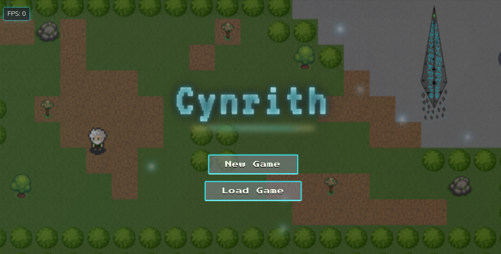

# Cynrith - by vCore

A browser-based 2D tile game built with JavaScript, HTML5, and Canvas.  
This project is a fork and extension of [orangeable/javascript-2d-tile-based-game](https://github.com/orangeable/javascript-2d-tile-based-game), with new features, UI enhancements, and gameplay improvements.

**⚠️ This project is in early development. All game assets are test/beta and subject to change.**



## Features

- Responsive HTML5 Canvas rendering
- Player movement and animation

**vCore Expansion:**
- **Modular:** extensible codebase for easy expansion
- **NPC and Enemy system**: Modular spawning, wandering AI, and dialogue
- **Combat system:**  
  - Hostile enemies detect and chase the player within a set radius  
  - Animated attack and knockback for both player and enemies  
  - Dynamic health bars and enemy names displayed above hostile enemies  
  - Loot and XP drops on enemy defeat, with respawn logic  
  - Player death and respawn menu  
- **Notification system**: Top-of-screen notifications for tips, events, and interactions
- **Dialogue system**: Bottom-of-screen dialogue blocks for story and NPC interaction, disables player movement during dialogue
- **Quest system:**  
  - NPCs can offer quests with different types (item collection, enemy defeat, gift quests, etc. to be expanded)
  - Quest progress and completion logic, including inventory checks and reward distribution (items, XP)
  - Gift quests allow instant rewards for engaging with NPCs
  - Quest menu with tabs for active and completed quests, updated dynamically
- **Inventory system**: 3x3 grid, item stacking, add/remove/use items, modular item definitions.
- **Menus and navigation**: With sprite preview and stats. Seamless switching between player menu, inventory, and future menus (skills, quests, etc.)
- **Teleportation and map warping**: Multi Level (Floor) Game With XP requirements and contextual notifications, allowing the player to travel the world as they please as they gain xp.
- **Title screen and lore intro:** Title screen with New Game/Load Game, and a lore intro sequence with skip functionality.
- **Touch/mouse/keyboard controls**: For both desktop and mobile.
- **Lore-rich worldbuilding:** Each floor features unique lore, NPCs, and environmental storytelling.
- **All assets are placeholders or in beta**

## Getting Started

1. **Clone the repository:**
   ```bash
   git clone https://github.com/vCore420/vTileGame.git
   cd vTileGame
   ```
2. **Open `index.html` in your browser**  
   (No build step required; works out-of-the-box!)

## Roadmap

- Quest system and quest menu (expanding quest types, save/load quest progress)
- Item usage and effects
- Expand NPC/Enemy behaviors (advace on movement animation)
- Save/load system
- Skil System
- Storyline
- Expand Floors to Expand Story and Npcs
- Improved assets and polish

- planing to make this a forever expanding propject, something i just wanted to have as my own litle world! I have tried to make it as modular as i know how to so I can keep expanding the game and world as time goes on!

## Credits

- Original engine and scripts by orangeable ([javascript-2d-tile-based-game](https://github.com/orangeable/javascript-2d-tile-based-game))
- Extended, customized, and maintained by vCore420

## License

This project is licensed under the MIT License.

## Contributing

Pull requests and suggestions are welcome. Or clone for your own project!

Enjoy
